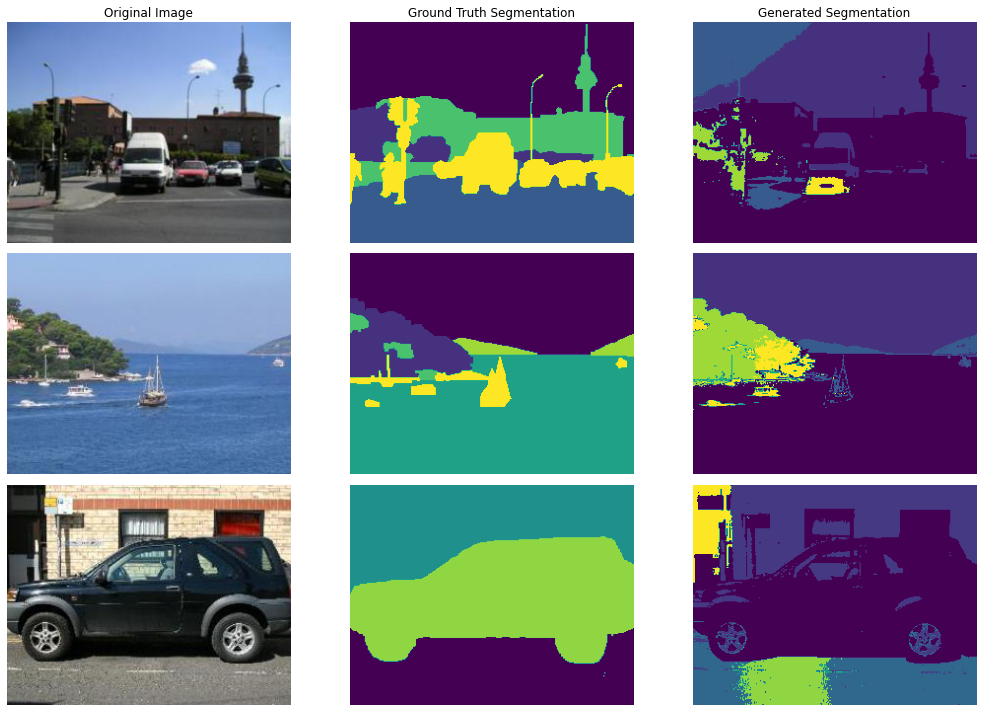
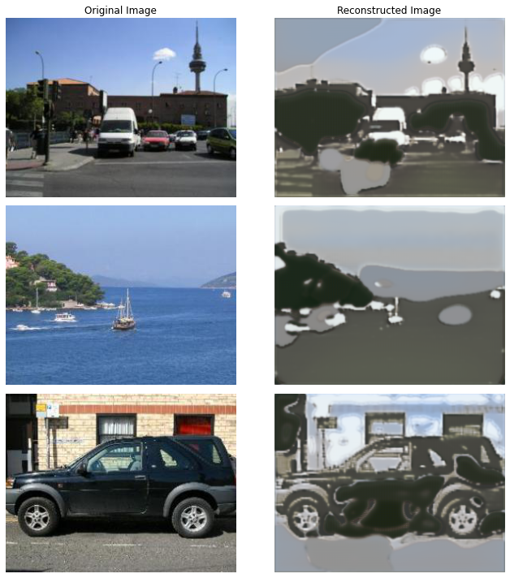
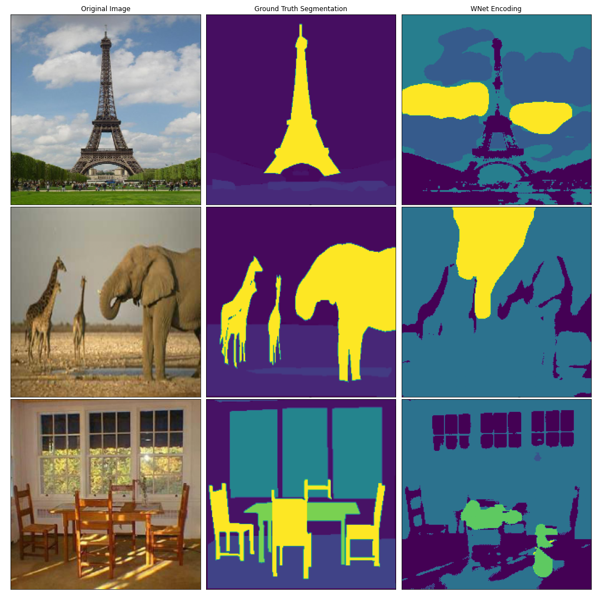
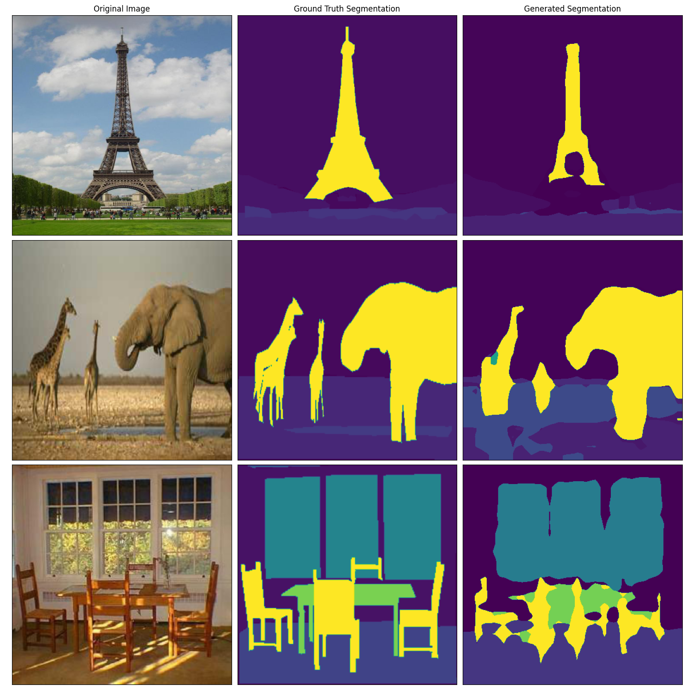
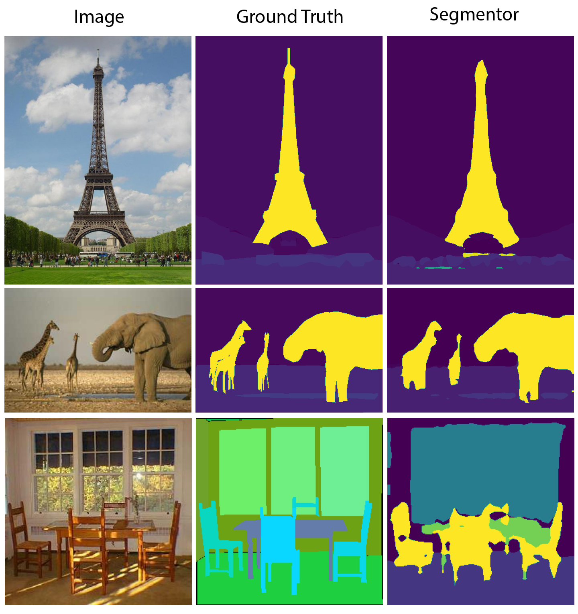
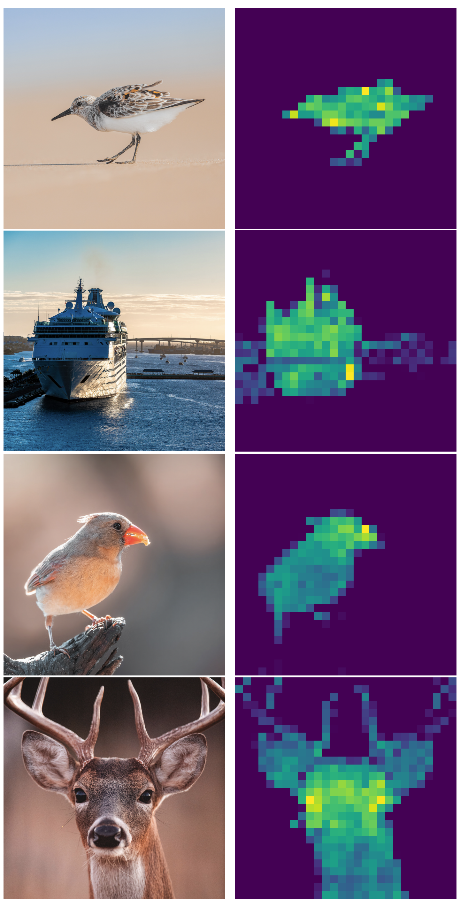

# Transformer Models In Unsupervised Semantic Segmentation

The purpose of this repository is to explore the application of the Vision Transformer in a variety
of semantic segmentaiton applications. Mainly, we want to explore a common method of convolutional unsupervised image
segmentation, and then both supervised and unsupervised methods of transformer based segmentations. All credit
goes to the original authors and we have done our best to cite all code and ideas borrowed from them. 

The three architecutures that we will explore are:
- [WNet](https://arxiv.org/pdf/1711.08506.pdf) - A Fully Convolutional Method of Unsupervised Segmentation
- [Segmenter](https://arxiv.org/pdf/2105.05633.pdf) - Supervised Segmentation powered by Transformers
- [DINO](https://arxiv.org/pdf/2104.14294.pdf) - Unsupervised  Attention Segmentation via Contrastive Learning

## Training Script
```
# Training for Segmenter Model
python -m train --model=segmenter --batch-size=16 --epochs=30 \
    --learning-rate=0.001 --pretrained --save-model --save-logs

# Training for WNet
python -m train --model=wnet --batch-size=16 --epochs=30 \
    --learning-rate=0.001 --pretrained --save-model --save-logs
```

## Visualizations

#### WNet

###### W-Net results on the MP4 dataset
Link to the model: https://drive.google.com/file/d/1sM6D0k04HJw3UQoLRsJDSBcgb1AU9Vwl/view?usp=sharing


###### W-Net results on the reconstruction task



###### W-Net results on the ADE20K dataset



#### Segmenter

###### `Tiny' Segmenter results on the ADE20K dataset (patch size: 16x16, token size=192)



###### `Standard' Segmenter results on the ADE20K dataset (patch size: 8x8, token size=768)



#### DINO

###### Attention maps generated by DINO




# References

For WNet, Segmenter, and DINO, we accredit the following papers and github repositories:

```
@misc{xia2017w,
  title={W-net: A deep model for fully unsupervised image segmentation},
  author={Xia, Xide and Kulis, Brian},
  journal={arXiv preprint arXiv:1711.08506},
  year={2017}
}

@misc{strudel2021segmenter,
      title={Segmenter: Transformer for Semantic Segmentation}, 
      author={Robin Strudel and Ricardo Garcia and Ivan Laptev and Cordelia Schmid},
      year={2021},
      eprint={2105.05633},
      archivePrefix={arXiv},
      primaryClass={cs.CV}
}

@misc{caron2021emerging,
      title={Emerging Properties in Self-Supervised Vision Transformers}, 
      author={Mathilde Caron and Hugo Touvron and Ishan Misra and Hervé Jégou and Julien Mairal and Piotr Bojanowski and Armand Joulin},
      year={2021},
      eprint={2104.14294},
      archivePrefix={arXiv},
      primaryClass={cs.CV}
}

@misc{fkodom,
  author={Frank Odom},
  title={wnet-unsupervised-image-segmentation},
  year={2019},
  publisher={GitHub},
  journal={GitHub repository},
  howpublished={\url{https://github.com/fkodom/wnet-unsupervised-image-segmentation}}
}

@misc{taoroalin,
  author={Tao Lin},
  title={WNet},
  year={2018},
  publisher={GitHub},
  journal={GitHub repository},
  howpublished={\url{https://github.com/taoroalin/WNet}}
}

```

We also gratitude the following resource, which provides us pre-trained transformer model used in our Segmenter implementation:
```
@misc{rw2019timm,
  author = {Ross Wightman},
  title = {PyTorch Image Models},
  year = {2019},
  publisher = {GitHub},
  journal = {GitHub repository},
  doi = {10.5281/zenodo.4414861},
  howpublished = {\url{https://github.com/rwightman/pytorch-image-models}}
}
```

Finally, we acknowledge the dataset we used to train and evaluate our implementations:
```
@inproceedings{zhou2017ade20k,
  title={Scene parsing through ade20k dataset},
  author={Zhou, Bolei and Zhao, Hang and Puig, Xavier and Fidler, Sanja and Barriuso, Adela and Torralba, Antonio},
  booktitle={Proceedings of the IEEE conference on computer vision and pattern recognition},
  pages={633--641},
  year={2017}
}

@article{zhou2019ade20k,
  title={Semantic understanding of scenes through the ade20k dataset},
  author={Zhou, Bolei and Zhao, Hang and Puig, Xavier and Xiao, Tete and Fidler, Sanja and Barriuso, Adela and Torralba, Antonio},
  journal={International Journal of Computer Vision},
  volume={127},
  number={3},
  pages={302--321},
  year={2019},
  publisher={Springer}
}
```

